# PCB-Design-and-Manufacturing-Portfolio-By-Jorge-Alvarado
This portfolio showcases my previous work in PCB design and fabrication since I learned to weld.  It includes pictures of various PCBs that I have designed and fabricated using Eagle Autodesk, KiCad and Proteus.

## Overview
I am a Bachelor in electronic engineering from the Universidad Peruana de Ciencias Aplicadas, with experience in designing and fabricating PCBs using KiCad. I have designed and fabricated numerous PCBs for various applications, including microcontroller circuits, use of peripherals, control and communications between microcontrollers or embedded systems, IoT, remote or distance wireless or wired communication.

## Projects
PCB design and manufacturing projects and developments with their respective enclosures

- Microcontroller circuit (Atmega328P, ESP32, PIC18f4550, Spartan 3 and others)
- Embedded systems (Raspberry Pi, cisco's switches, Arduino, Jetson Nano and others)
- Motor driver circuit with controller.
- Power supply circuit in removable sections.
- 3D models capable of encapsulating and protect the PCB.

## Skills
Skills about my design and manufacturing:

- Designing and routing PCBs using KiCad (more than the others for being open source).
- Knowledge of PCB layout design principles, delimitation of sections of PCBs.
- Maximize the use of single-layer PCBs.
- Knowledge of foreign or local manufacturing types, quality levels, and formats.
- Creating custom footprints for components or devices pre-purchased.
- Selecting appropriate components and connectors for specific applications.
- Soldering and assembling PCBs single-layer or multi-layer.
- Knowledge of component or part sizes depending on the needs of the PCB'.
- Scalability of projects or PCBs depending on the capacity of the microcomponents.

## Pictures
Pictures of my previous PCB design and fabrication work and some cases:

|  |  |  |  |
| ------- | ------- | ------- | ------- |
| 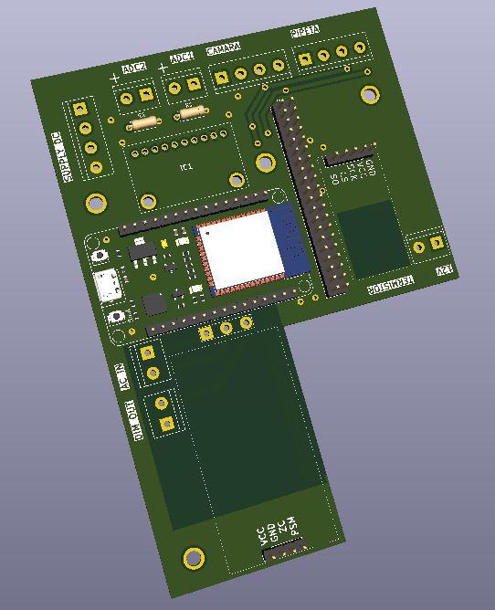 | 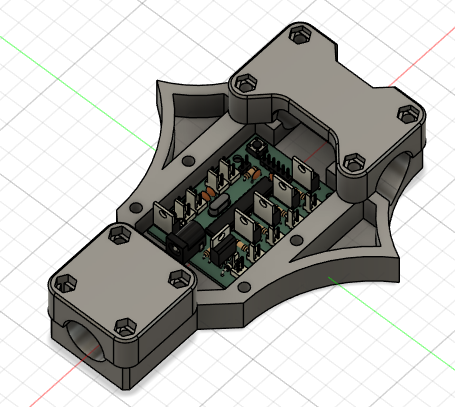  | 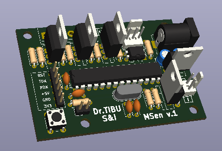 | 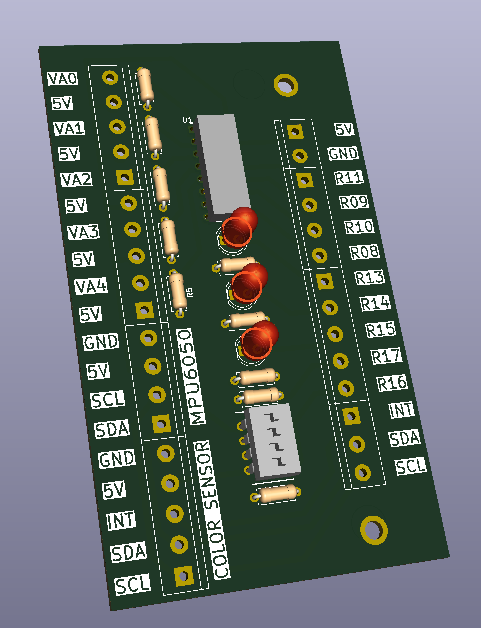  ||
| 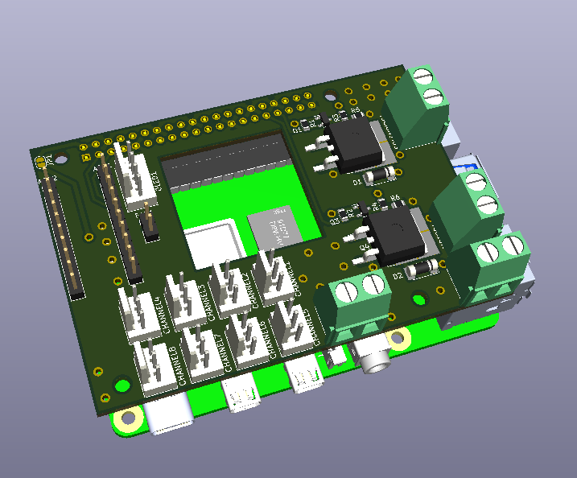 | 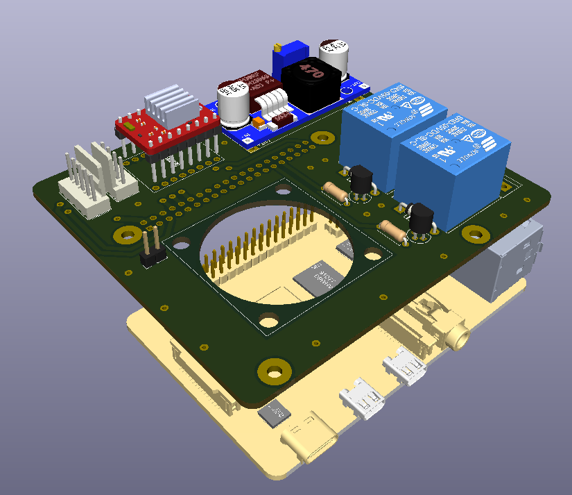  | 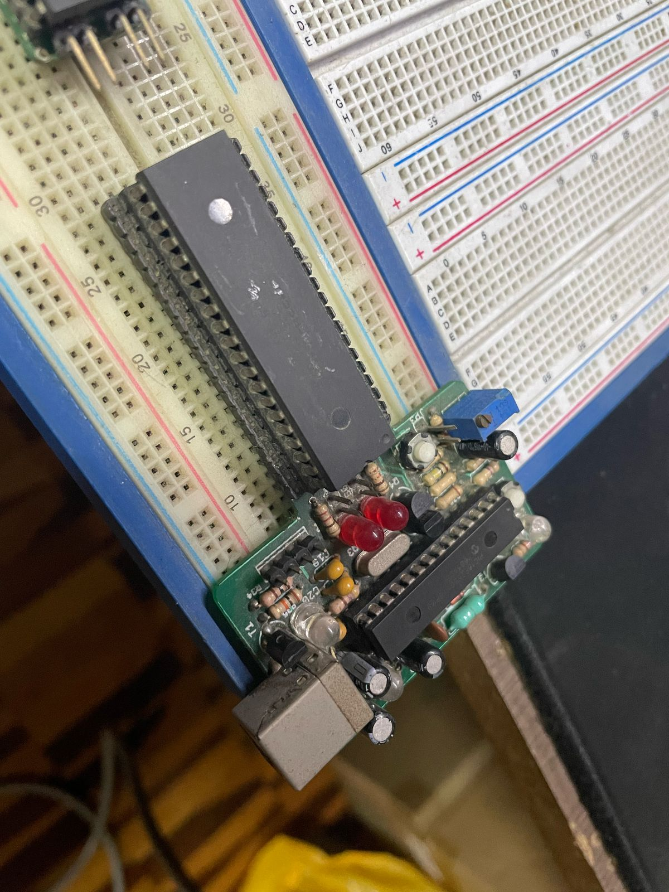 | 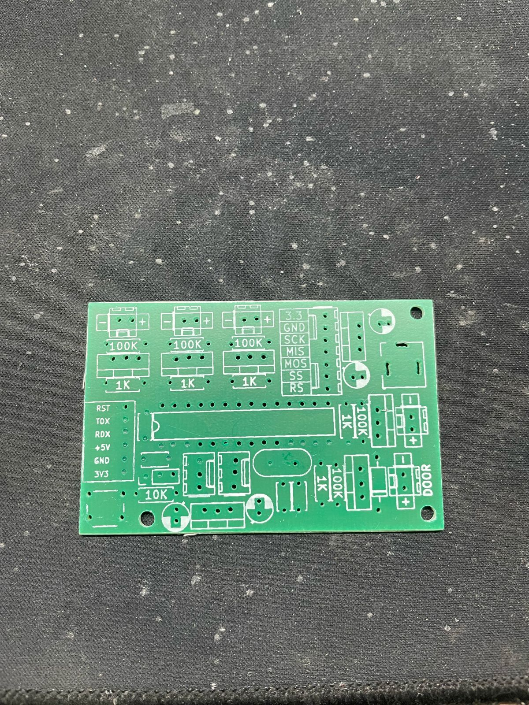  ||
|  |   |  | 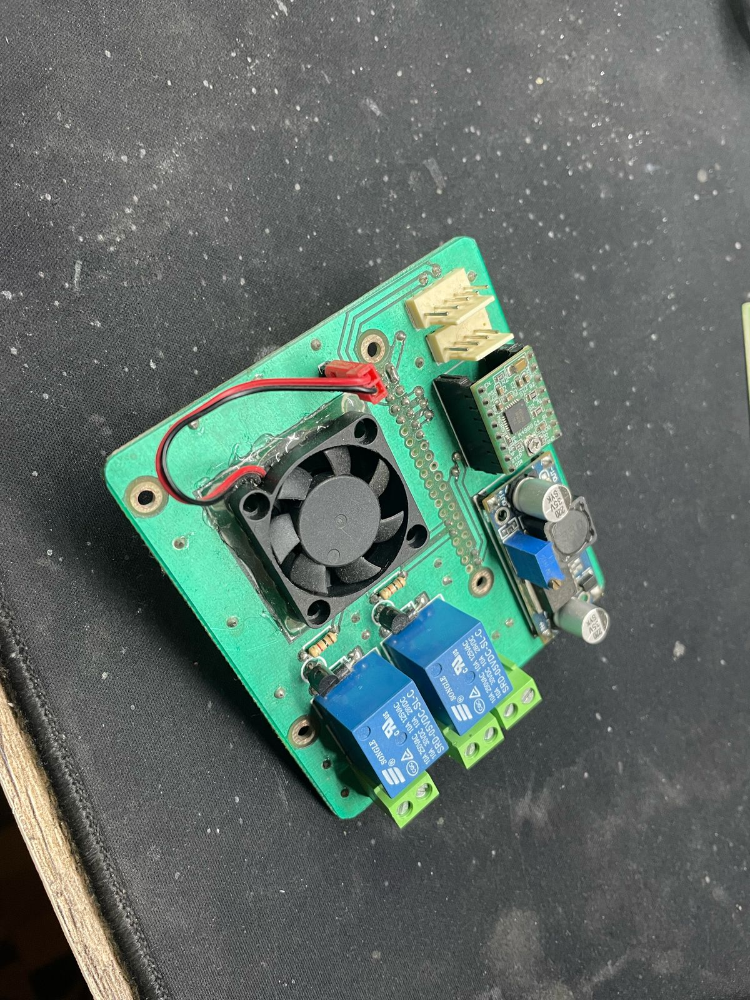  ||
| 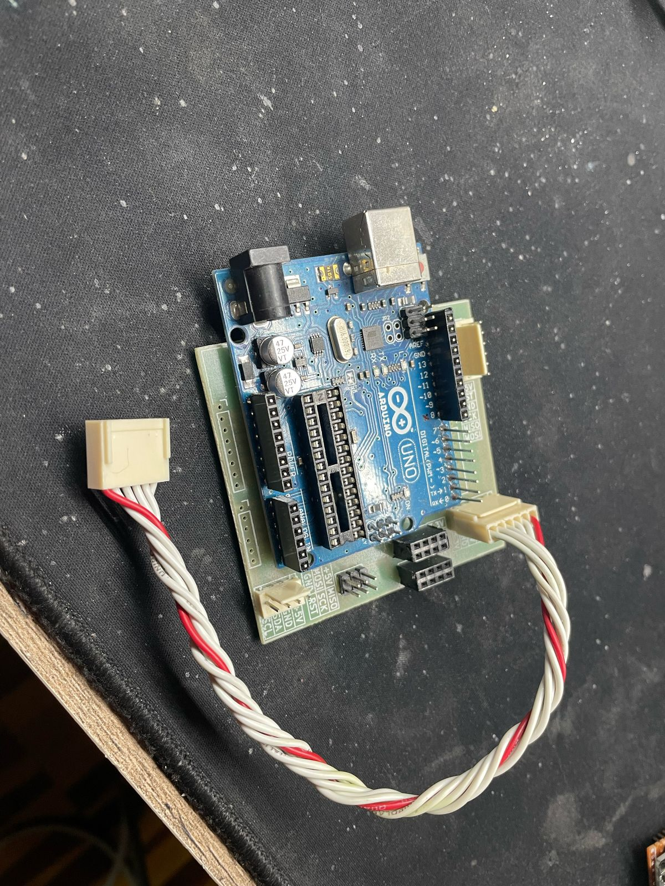 | 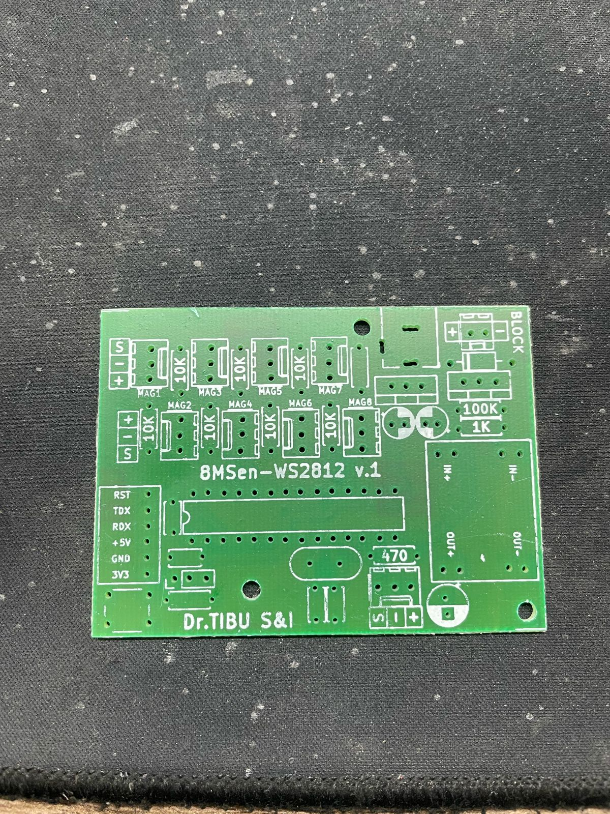  | 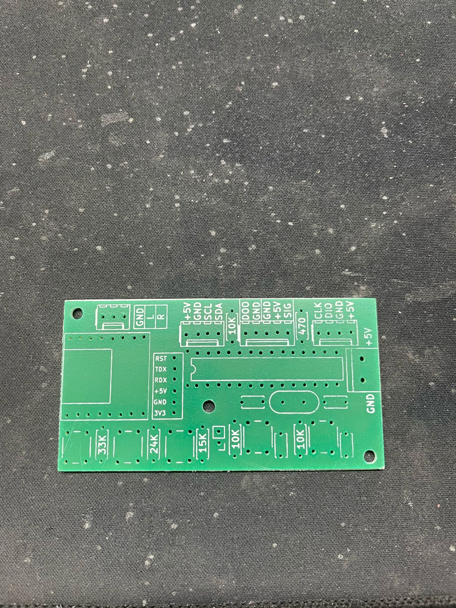 | 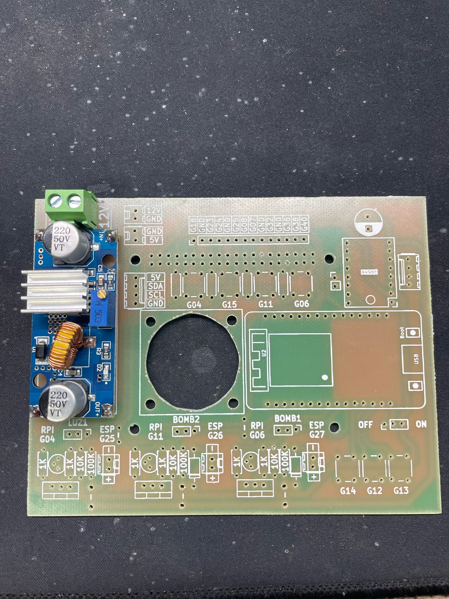  ||

